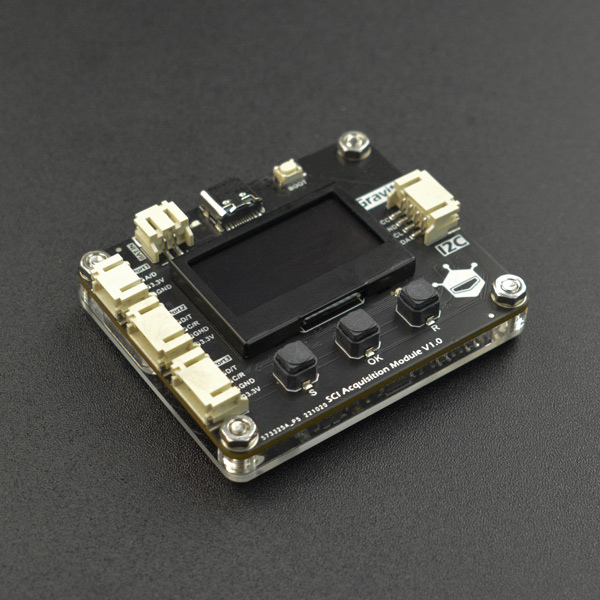

# DFRobot_RP2040_SCI
===========================

- [English Version](./README.md)

SCI采集模块(SCI Acquisition Module)是DFRobot设计的一款传感器转接板，它能够连接DFRobot的模拟、数字、I2C、UART等传感器，并将传感器采集到的数据转换为 名称+数据+单位的格式，供主控读取，或显示在板载的显示屏上供用户查看。看到这里，相信很多人都对它的使用有疑问，接下来我就用问答的方式来详细的介绍这块板子的功能: <br>
* 问题1. DFRobot有那么多传感器，这块板子都能识别么？
  答：不是哦，目前这个板子只支持了DFRobot的部分传感器，用户可以通过README的SKU支持列表、板载的按钮和屏的交互界面查看SKU Select、或通过主控读取等方式获取各类型传感器的支持列表。
* 问题2：我想使用的模拟、数字、I2C或UART传感器不在支持列表里面怎么办?
  答：完全不用担心这个问题，SCI采集模块(SCI Acquisition Module)有U盘固件升级的功能，你可以给我们留言，我们会将该传感器加入支持列表中，后续只要通过这个U盘固件升级功能烧录最新的固件就可以了。
* 问题3: SCI采集模块(SCI Acquisition Module)能识别不同的传感器的原理是什么呢？
  答：DFRobot每个传感器都有一个唯一的SKU，适配器板通过自动识别或用户选择的SKU来识别连接的是那个传感器，并调用相应的驱动程序来采集和转换数据。（注意：除部分I2C传感器可以通过I2C地址识别SKU外，其他的传感器只能通过用户手动选择SKU，告诉适配器板连接的是哪个传感器）
* 问题4：SCI采集模块(SCI Acquisition Module)和这些传感器之间是通过什么连接的呢？
  答：适配器板上板载了1个Gravity 3pin的模拟/数字切换接口(A&D 连接模拟或数字传感器),以及2个Gravity 4pin的I2C/UART接口(I2C&UART 连接I2C或UART传感器), 用户可以通过切换对应接口的模式来连接相应的传感器。
* 问题5：板载的按钮和屏交互界面有什么用呢?
  答: 用户可以通过这些配置和查看SCI采集模块(SCI Acquisition Module)的参数，比如I2C从机地址，时间，接口模式切换，选择SKU，固件版本，传感器数据。
* 问题6：如何用Arduino主控或树莓派读取和设置SCI采集模块(SCI Acquisition Module)的参数，以及读取传感器数据呢?
  答：SCI采集模块(SCI Acquisition Module)板载了一个Gravity I2C接口，主控可以通过这个接口操作适配器板。
* 问题7：SCI采集模块(SCI Acquisition Module)上的USB有什么用呢？
  答：固件升级或导出CSV文件。按住boot键上电进入U盘固件升级模式，可以升级固件，直接上电会弹出一个U盘，用户可以在这里查看或导出记录传感器数据的CSV文件。




## 产品链接 (https://www.dfrobot.com.cn/goods-3658.html)
    SKU: DFR0999

## 模拟接口支持模块的 SKU
* SEN0114
* SEN0161
* SEN0193
* SEN0231
* SEN0232
* SEN0244
* DFR0300


## 数字接口支持模块的 SKU
* KIT0021

## I2C接口支持模块的 SKU
* TEL0157
* KIT0176
* DFR0216
* SEN0206
* SEN0228
* SEN0291
* SEN0304
* SEN0321
* SEN0322
* SEN0334
* SEN0364
* SEN0456
* SEN0460
* SEN0497
* SEN0514
* SEN0517
* SEN0518
* SEN0529
* SEN0536
* SEN0540

## UART接口支持模块的 SKU
* NULL

## 目录

* [概述](#概述)
* [库安装](#库安装)
* [方法](#方法)
* [兼容性](#兼容性)
* [历史](#历史)
* [创作者](#创作者)

## 概述

这是一个基于Arduino平台的SCI采集模块(SCI Acquisition Module)库。旨在为用户提供一系列接口函数去设置和读取该适配器板的参数，以及读取适配器板上各传感器的数据，它具有以下功能：<br>
* 1. 读取/设置SCI采集模块(SCI Acquisition Module)的I2C地址，范围0x01~0x7F；
* 2. 读取/设置SCI采集模块(SCI Acquisition Module)的年，月，日，时，分，秒的时间；
* 3. 开启/关闭传感器数据CSV文件记录；
* 4. 开启/关闭屏显示
* 5. 读取和设置接口传感器模式，以及SKU
* 6. 以读取传感器数据(名称+数值+单位)
* 7. 读取模拟、数字、I2C、UART等类型传感器的SKU支持列表

## 库安装

这里有2种安装方法：
1. 使用此库前，请首先下载库文件，将其粘贴到\Arduino\libraries目录中，然后打开examples文件夹并在该文件夹中运行演示。
2. 直接在Arduino软件库管理中搜索下载 DFRobot_RP2040_SCI 库

## 方法

```C++
  /**
   * @fn DFRobot_RP2040_SCI_IIC
   * @brief DFRobot_RP2040_SCI_IIC 类的构造函数.
   * @param addr:  7位I2C地址，支持以下地址设置
   * @n RP2040_SCI_ADDR_0X21      0x21 转换板默认I2C地址
   * @n RP2040_SCI_ADDR_0X22      0x22
   * @n RP2040_SCI_ADDR_0X23      0x23
   * @n 或通过板子的OLED屏的初始页查看I2C地址，出厂默认I2C地址为0x01
   * @param pWire:   TwoWire类对象指针.
   */
  DFRobot_RP2040_SCI_IIC(uint8_t addr = RP2040_SCI_ADDR_0X21, TwoWire *pWire = &Wire);
  ~DFRobot_RP2040_SCI_IIC();

  /**
   * @fn setI2CAddress
   * @brief 设置SCI采集模块(SCI Acquisition Module)的I2C通信地址
   * 
   * @param addr    SCI采集模块(SCI Acquisition Module)的I2C通信地址，支持以下地址设置
   * @n RP2040_SCI_ADDR_0X21      0x21 转换板默认I2C地址
   * @n RP2040_SCI_ADDR_0X22      0x22
   * @n RP2040_SCI_ADDR_0X23      0x23
   * @return uint8_t 错误代码
   * @n      ERR_CODE_NONE         or 0x00  设置成功
   * @n      ERR_CODE_CMD_INVAILED or 0x01  无效命令
   * @n      ERR_CODE_RES_PKT      or 0x02  响应包错误
   * @n      ERR_CODE_M_NO_SPACE   or 0x03  I2C主机内存不够
   * @n      ERR_CODE_RES_TIMEOUT  or 0x04  响应包接收超时
   * @n      ERR_CODE_CMD_PKT      or 0x05  无效的命令包或者命令不匹配 
   * @n      ERR_CODE_I2C_ADRESS   or 0x0A  I2C地址无效
   */
  uint8_t setI2CAddress(uint8_t addr);

  /**
   * @fn getI2CAddress
   * @brief 获取SCI采集模块(SCI Acquisition Module)的I2C通信地址
   * @return I2C通信地址
   */
  uint8_t getI2CAddress();

  /**
   * @fn DFRobot_RP2040_SCI
   * @brief DFRobot_RP2040_SCI类的构造函数.
   */
  DFRobot_RP2040_SCI();

  /**
   * @fn  ~DFRobot_RP2040_SCI
   * @brief DFRobot_RP2040_SCI类的析构函数. 
   */
  ~DFRobot_RP2040_SCI();
  
  /**
   * @fn begin
   * @brief SCI采集模块(SCI Acquisition Module)初始化，旨在初始化通信接口
   * 
   * @param freq 设置通信频率,不能超过100kHz
   * @return int 初始化状态
   * @n       0  初始化成功
   * @n      -1  通信接口类对象未传入
   * @n      -2  请检测硬件连接是否正确
   */
  int begin(uint32_t freq = 100000);

  /**
   * @fn getVersion
   * @brief 获取SCI采集模块(SCI Acquisition Module)的固件版本号
   * @n 版本号是一个16位数据，高8位(b15~b9): 代表最高版本位
   * @n 中4位(b8~b4):表示中间版本位
   * @n 低4位：表示低版本位
   * @n 例0x0123对应的版本号为 V1.2.3
   * 
   * @return 16位版本号
   */
  uint16_t getVersion();

  /**
   * @fn getVersionDescription
   * @brief 获取版本描述字符串
   * 
   * @return 返回版本描述字符串，例版本id：0x0123返回的版本描述字符串为 V1.2.3
   */
  String getVersionDescription(uint16_t version);

  /**
   * @fn setPort1(char *sku)
   * @brief 设置Port1的SKU，此接口可连接模拟传感器和数字传感器，通过SKU选择Port1上连接的传感器
   * 
   * @param sku  Port1接口的参数，支持的SKU列表可以通过OLED显示或者 getAnalogSensorSKU()/getDigitalSensorSKU()查看
   * @n     "NULL"       表示清除Port1接口的传感器设置,并将传感器模式配置为模拟传感器配置
   * @n     "Analog"     表示选择Analog电压数据采集，单位mV
   * @n     模拟传感器SKU 表示选择了某个模拟传感器的SKU，并将模式配置为模拟传感器模式
   * @n     数字传感器SKU 表示选择了某个数字传感器的SKU，并将模式配置为数字传感器模式
   * @return uint8_t 错误代码
   * @n      ERR_CODE_NONE         or 0x00  设置成功
   * @n      ERR_CODE_CMD_INVAILED or 0x01  无效命令
   * @n      ERR_CODE_RES_PKT      or 0x02  响应包错误
   * @n      ERR_CODE_M_NO_SPACE   or 0x03  I2C主机内存不够
   * @n      ERR_CODE_RES_TIMEOUT  or 0x04  响应包接收超时
   * @n      ERR_CODE_CMD_PKT      or 0x05  无效的命令包或者命令不匹配
   * @n      ERR_CODE_SLAVE_BREAK  or 0x06  从机故障
   * @n      ERR_CODE_ARGS         or 0x07  设置的参数错误
   */
  uint8_t setPort1(char *sku);

  /**
   * @fn getPort1(ePort1IFMode_t mode)
   * @brief 获取Port1接口的传感器模式，及SKU配置
   * 
   * @param mode  eADIFMode_t枚举变量指针
   * @n     eAnalogMode    模拟传感器模式
   * @n     eDigitalMode   数字传感器模式
   * @return 接口0连接的传感器的SKU
   * @n      "NULL"        表示Port1接口没有配置或连接传感器
   * @n      "Analog"      表示Port1接口被配置为读取Port1接口两端的电压数据
   * @n      7位SKU        表示Port1接口被配置为读数字或模拟传感器的数据
   */
  String getPort1(ePort1IFMode_t *mode);

  /**
   * @fn setPort2(char *sku)
   * @brief 设置Port2的SKU，此接口可连接I2C传感器和UART传感器，其中UART传感器需通过SKU选择，I2C是连接后，自动选择，只需将Port2配置为I2C模式即可
   * 
   * @param sku  Port2接口的参数，支持的SKU列表可以通过OLED显示或者 getUARTSensorSKU()查看
   * @n     "NULL"       将Port配置为I2C模式，并清除Port2上关于UART传感器的配置
   * @n     UART传感器SKU 表示选择了某个UART传感器的SKU，并将模式配置为UART传感器模式
   * @return uint8_t 错误代码
   * @n      ERR_CODE_NONE         or 0x00  设置成功
   * @n      ERR_CODE_CMD_INVAILED or 0x01  无效命令
   * @n      ERR_CODE_RES_PKT      or 0x02  响应包错误
   * @n      ERR_CODE_M_NO_SPACE   or 0x03  I2C主机内存不够
   * @n      ERR_CODE_RES_TIMEOUT  or 0x04  响应包接收超时
   * @n      ERR_CODE_CMD_PKT      or 0x05  无效的命令包或者命令不匹配
   * @n      ERR_CODE_SLAVE_BREAK  or 0x06  从机故障
   * @n      ERR_CODE_ARGS         or 0x07  设置的参数错误
   * @n      ERR_CODE_SKU          or 0x08  该SKU为无效SKU，或者传感器通用适配器板(Sensor Universal Adapter Board)不支持
   * @n      ERR_CODE_S_NO_SPACE   or 0x09  I2C从机内存不够
   */
  uint8_t setPort2(char *sku);

  /**
   * @fn getPort2(ePort23Mode_t mode)
   * @brief 获取Port2的传感器模式，及SKU配置
   * 
   * @param mode  eI2CUARTMode_t 枚举变量指针
   * @n     eI2CMode    I2C传感器模式
   * @n     eUARTMode   UART传感器模式
   * @return 接口0连接的传感器的SKU
   * @n      "NULL"        表示接口0没有配置或连接传感器
   * @n      7位SKU集合     I2C或UART传感器对应的SKU
   */
  String getPort2(ePort23Mode_t *mode);

  /**
   * @fn setPort3(char *sku)
   * @brief 设置Port3的SKU，此接口可连接I2C传感器和UART传感器，其中UART传感器需通过SKU选择，I2C是连接后，自动选择，只需将Port3配置为I2C模式即可
   * 
   * @param sku  Port3接口的参数，支持的SKU列表可以通过OLED显示或者 getUARTSensorSKU()查看
   * @n     "NULL"       将Port配置为I2C模式，并清除Port3上关于UART传感器的配置
   * @n     UART传感器SKU 表示选择了某个UART传感器的SKU，并将模式配置为UART传感器模式
   * @return uint8_t 错误代码
   * @n      ERR_CODE_NONE         or 0x00  设置成功
   * @n      ERR_CODE_CMD_INVAILED or 0x01  无效命令
   * @n      ERR_CODE_RES_PKT      or 0x02  响应包错误
   * @n      ERR_CODE_M_NO_SPACE   or 0x03  I2C主机内存不够
   * @n      ERR_CODE_RES_TIMEOUT  or 0x04  响应包接收超时
   * @n      ERR_CODE_CMD_PKT      or 0x05  无效的命令包或者命令不匹配
   * @n      ERR_CODE_SLAVE_BREAK  or 0x06  从机故障
   * @n      ERR_CODE_ARGS         or 0x07  设置的参数错误
   */
  uint8_t setPort3(char *sku);

  /**
   * @fn getPort3(ePort23Mode_t mode)
   * @brief 获取Port3的传感器模式，及SKU配置
   * 
   * @param mode  eI2CUARTMode_t 枚举变量指针
   * @n     eI2CMode    I2C传感器模式
   * @n     eUARTMode   UART传感器模式
   * @return 接口0连接的传感器的SKU
   * @n      "NULL"        表示接口0没有配置或连接传感器
   * @n      7位SKU集合     I2C或UART传感器对应的SKU
   */
  String getPort3(ePort23Mode_t *mode);

  /**
   * @fn setRecvTimeout
   * @brief 设置接收超时时间
   * 
   * @param timeout 当SCI采集模块连接的传感器较多时，在读取大量数据时需要适当提高接收超时时间，默认2s
   */
  void setRecvTimeout(uint32_t timeout = 2000);

  /**
   * @fn adjustRtc(const __FlashStringHelper* date, const __FlashStringHelper* time)
   * @brief 设置SCI采集模块(SCI Acquisition Module)的时间
   * 
   * @param date 年月日
   * @param time 时分秒
   * @return 错误代码
   * @n      ERR_CODE_NONE         or 0x00  设置成功
   * @n      ERR_CODE_CMD_INVAILED or 0x01  无效命令
   * @n      ERR_CODE_RES_PKT      or 0x02  响应包错误
   * @n      ERR_CODE_M_NO_SPACE   or 0x03  I2C主机内存不够
   * @n      ERR_CODE_RES_TIMEOUT  or 0x04  响应包接收超时
   * @n      ERR_CODE_CMD_PKT      or 0x05  无效的命令包或者命令不匹配
   */
  uint8_t adjustRtc(const __FlashStringHelper* date, const __FlashStringHelper* time);
	/**
   * @fn adjustRtc(uint16_t year, uint8_t month, uint8_t day, uint8_t week, uint8_t hour, uint8_t minute, uint8_t second)
   * @brief 设置SCI采集模块(SCI Acquisition Module)的时间
   * 
   * @param year   年
   * @param month  月
   * @param day    日
   * @param week   周
   * @param hour   时
   * @param minute 分
   * @param second 秒
   * @return uint8_t 错误代码
   * @n      ERR_CODE_NONE         or 0x00  设置成功
   * @n      ERR_CODE_CMD_INVAILED or 0x01  无效命令
   * @n      ERR_CODE_RES_PKT      or 0x02  响应包错误
   * @n      ERR_CODE_M_NO_SPACE   or 0x03  I2C主机内存不够
   * @n      ERR_CODE_RES_TIMEOUT  or 0x04  响应包接收超时
   * @n      ERR_CODE_CMD_PKT      or 0x05  无效的命令包或者命令不匹配
   */
  uint8_t adjustRtc(uint16_t year, uint8_t month, uint8_t day, uint8_t week, uint8_t hour, uint8_t minute, uint8_t second);

  /**
   * @fn getRtcTime(uint16_t *year, uint8_t *month, uint8_t *day, uint8_t *week, uint8_t *hour, uint8_t *minute, uint8_t *second)
   * @brief 获取SCI采集模块(SCI Acquisition Module)的年月日时分秒周等日期
   * 
   * @param year   年
   * @param month  月
   * @param day    日
   * @param week   周
   * @param hour   时
   * @param minute 分
   * @param second 秒
   * @return uint8_t 错误代码
   * @n      ERR_CODE_NONE         or 0x00  设置成功
   * @n      ERR_CODE_CMD_INVAILED or 0x01  无效命令
   * @n      ERR_CODE_RES_PKT      or 0x02  响应包错误
   * @n      ERR_CODE_M_NO_SPACE   or 0x03  I2C主机内存不够
   * @n      ERR_CODE_RES_TIMEOUT  or 0x04  响应包接收超时
   * @n      ERR_CODE_CMD_PKT      or 0x05  无效的命令包或者命令不匹配
   */
  uint8_t getRtcTime(uint16_t *year, uint8_t *month, uint8_t *day, uint8_t *week, uint8_t *hour, uint8_t *minute, uint8_t *second);

  /**
   * @fn getRtcTime()
   * @brief 获取SCI采集模块(SCI Acquisition Module)的年月日时分秒周等日期
   * 
   * @return 年/月/日 周 时:分:秒表示的字符串，例 2022/08/09 2 09:08:00 2022年8月9日，星期二 9点8分0秒
   */
  String getRtcTime();

  /**
   * @fn setRefreshRate
   * @brief 设置数据刷新时间
   * 
   * @param refreshRate eRefreshRate_t枚举变量
   * @n eRefreshRateMs     ms级刷新率，按数据的实际刷新率刷新
   * @n eRefreshRate1s     刷新率1s，如果数据实际刷新时间小于此值，则按此值刷新，若大于此值，则按数据实际刷新率刷新
   * @n eRefreshRate3s     刷新率3s，如果数据实际刷新时间小于此值，则按此值刷新，若大于此值，则按数据实际刷新率刷新
   * @n eRefreshRate5s     刷新率5s，如果数据实际刷新时间小于此值，则按此值刷新，若大于此值，则按数据实际刷新率刷新
   * @n eRefreshRate10s    刷新率10s，如果数据实际刷新时间小于此值，则按此值刷新，若大于此值，则按数据实际刷新率刷新
   * @n eRefreshRate30s    刷新率30s，如果数据实际刷新时间小于此值，则按此值刷新，若大于此值，则按数据实际刷新率刷新
   * @n eRefreshRate1min   刷新率1min，如果数据实际刷新时间小于此值，则按此值刷新，若大于此值，则按数据实际刷新率刷新
   * @n eRefreshRate5min   刷新率5min，如果数据实际刷新时间小于此值，则按此值刷新，若大于此值，则按数据实际刷新率刷新
   * @n eRefreshRate10min  刷新率10min，如果数据实际刷新时间小于此值，则按此值刷新，若大于此值，则按数据实际刷新率刷新
   * @return uint8_t 错误代码
   * @n      ERR_CODE_NONE         or 0x00  设置成功
   * @n      ERR_CODE_CMD_INVAILED or 0x01  无效命令
   * @n      ERR_CODE_RES_PKT      or 0x02  响应包错误
   * @n      ERR_CODE_M_NO_SPACE   or 0x03  I2C主机内存不够
   * @n      ERR_CODE_RES_TIMEOUT  or 0x04  响应包接收超时
   * @n      ERR_CODE_CMD_PKT      or 0x05  无效的命令包或者命令不匹配
   */
  uint8_t setRefreshRate(eRefreshRate_t refreshRate);

  /**
   * @fn getRefreshRate
   * @brief 获取设置的刷新时间，注意此刷新时间可能不是数据实际刷新时间，它们之间满足这样的关系: 设置的刷新时间 <= 数据实际刷新时间
   * 
   * @param refreshRate eRefreshRate_t枚举变量，获取等级
   * @n eRefreshRateMs     ms级刷新率，按数据的实际刷新率刷新
   * @n eRefreshRate1s     刷新率1s，如果数据实际刷新时间小于此值，则按此值刷新，若大于此值，则按数据实际刷新率刷新
   * @n eRefreshRate3s     刷新率3s，如果数据实际刷新时间小于此值，则按此值刷新，若大于此值，则按数据实际刷新率刷新
   * @n eRefreshRate5s     刷新率5s，如果数据实际刷新时间小于此值，则按此值刷新，若大于此值，则按数据实际刷新率刷新
   * @n eRefreshRate10s    刷新率10s，如果数据实际刷新时间小于此值，则按此值刷新，若大于此值，则按数据实际刷新率刷新
   * @n eRefreshRate30s    刷新率30s，如果数据实际刷新时间小于此值，则按此值刷新，若大于此值，则按数据实际刷新率刷新
   * @n eRefreshRate1min   刷新率1min，如果数据实际刷新时间小于此值，则按此值刷新，若大于此值，则按数据实际刷新率刷新
   * @n eRefreshRate5min   刷新率5min，如果数据实际刷新时间小于此值，则按此值刷新，若大于此值，则按数据实际刷新率刷新
   * @n eRefreshRate10min  刷新率10min，如果数据实际刷新时间小于此值，则按此值刷新，若大于此值，则按数据实际刷新率刷新
   * @return uint32_t 返回刷新时间，单位ms
   * @n eRefreshRateMs     0ms
   * @n eRefreshRate1s     1000ms
   * @n eRefreshRate3s     3000ms
   * @n eRefreshRate5s     5000ms
   * @n eRefreshRate10s    10000ms
   * @n eRefreshRate30s    30000ms
   * @n eRefreshRate1min   60000ms
   * @n eRefreshRate5min   300000ms
   * @n eRefreshRate10min  600000ms
   */
  uint32_t getRefreshRate(eRefreshRate_t *refreshRate = NULL);

  /**
   * @fn getTimeStamp()
   * @brief 获取时间戳,此时间戳为(SCI Acquisition Module)数据刷新时间
   * 
   * @return 时:分:秒(00:00:00) 或 分:秒.百分之（0~99）秒(00:00.00)
   */
  String getTimeStamp();
  
  /**
   * @fn getSensorModeDescribe(ePort1IFMode_t mode)
   * @brief 获取传感器的模式描述
   * 
   * @param mode  ePort1IFMode_t枚举变量
   * @n     eAnalogMode    模拟传感器模式
   * @n     eDigitalMode   数字传感器模式
   * @return 传感器的模式描述字符串
   * @n      "ANALOG"         模拟传感器模式
   * @n      "DIGITAL"        数字传感器模式
   * @n      "UNKNOWN"        未知模式
   */
  String getSensorModeDescribe(ePort1IFMode_t mode);

  /**
   * @fn getSensorModeDescribe(ePort23Mode_t mode)
   * @brief 获取传感器的模式描述
   * 
   * @param mode  ePort23Mode_t 枚举变量
   * @n     eI2CMode    I2C传感器模式
   * @n     eUARTMode   UART传感器模式
   * @return 传感器的模式描述字符串
   * @n      "I2C"         I2C传感器模式
   * @n      "UART"        UART传感器模式
   * @n      "UNKNOWN"     未知模式
   */
  String getSensorModeDescribe(ePort23Mode_t mode);
  
  /**
   * @fn enableRecord
   * @brief 开启CSV文件记录，调用此命令后，会将传感器采集到的数据记录在以年月日时分秒命名的CSV文件中
   * 
   * @return uint8_t 错误代码
   * @n      ERR_CODE_NONE         or 0x00  设置成功
   * @n      ERR_CODE_CMD_INVAILED or 0x01  无效命令
   * @n      ERR_CODE_RES_PKT      or 0x02  响应包错误
   * @n      ERR_CODE_M_NO_SPACE   or 0x03  I2C主机内存不够
   * @n      ERR_CODE_RES_TIMEOUT  or 0x04  响应包接收超时
   * @n      ERR_CODE_CMD_PKT      or 0x05  无效的命令包或者命令不匹配
   */
  uint8_t enableRecord();

  /**
   * @fn disableRecord
   * @brief 关闭CSV文件记录，调用此命令后，会停止将传感器采集到的数据记录在以年月日时分秒命名的CSV文件中
   * 
   * @return uint8_t 错误代码
   * @n      ERR_CODE_NONE         or 0x00  设置成功
   * @n      ERR_CODE_CMD_INVAILED or 0x01  无效命令
   * @n      ERR_CODE_RES_PKT      or 0x02  响应包错误
   * @n      ERR_CODE_M_NO_SPACE   or 0x03  I2C主机内存不够
   * @n      ERR_CODE_RES_TIMEOUT  or 0x04  响应包接收超时
   * @n      ERR_CODE_CMD_PKT      or 0x05  无效的命令包或者命令不匹配
   */
  uint8_t disableRecord();
  
  /**
   * @fn oledScreenOn
   * @brief 开启SCI采集模块(SCI Acquisition Module)屏显示
   * 
   * @return uint8_t 错误代码
   * @n      ERR_CODE_NONE         or 0x00  设置成功
   * @n      ERR_CODE_CMD_INVAILED or 0x01  无效命令
   * @n      ERR_CODE_RES_PKT      or 0x02  响应包错误
   * @n      ERR_CODE_M_NO_SPACE   or 0x03  I2C主机内存不够
   * @n      ERR_CODE_RES_TIMEOUT  or 0x04  响应包接收超时
   * @n      ERR_CODE_CMD_PKT      or 0x05  无效的命令包或者命令不匹配
   */
  uint8_t oledScreenOn();

  /**
   * @fn oledScreenOff
   * @brief 关闭SCI采集模块(SCI Acquisition Module)屏显示
   * 
   * @return uint8_t 错误代码
   * @n      ERR_CODE_NONE         or 0x00  设置成功
   * @n      ERR_CODE_CMD_INVAILED or 0x01  无效命令
   * @n      ERR_CODE_RES_PKT      or 0x02  响应包错误
   * @n      ERR_CODE_M_NO_SPACE   or 0x03  I2C主机内存不够
   * @n      ERR_CODE_RES_TIMEOUT  or 0x04  响应包接收超时
   * @n      ERR_CODE_CMD_PKT      or 0x05  无效的命令包或者命令不匹配
   */
  uint8_t oledScreenOff();
  
  /**
   * @fn getInformation
   * @brief 获取SCI采集模块(SCI Acquisition Module)上一个或多个接口连接的传感器的信息，名称:数值 单位,多条信息之间
   * @n 用','号隔开
   * 
   * @param inf    接口选择
   * @n     ePort1                                           选中Port1接口
   * @n     ePort2                                           选中Port2接口
   * @n     ePort3                                           选中Port3接口
   * @n     eALL  or  (ePort1 | ePort2 | ePort3)             选中Port1, Port2和Port3接口
   * @param timestamp 获取的信息中是否加时间戳
   * @n     false  不加时间戳
   * @n     ture   加时间戳   
   * @return 选中的接口上连接的传感器的属性，每条属性格式为：名称:数值 单位，多条属性之间用','号隔开,单位和数值之间用空格隔开
   * @n 不加时间戳 例SEN0334:  Temp_Air:28.65 C,Humi_Air:30.12 %RH
   * @n 加时间戳   例SEN0334:  分:秒.百分之(0~99)秒 Temp_Air:28.65 C,Humi_Air:30.12 %RH 或 时:分:秒 Temp_Air:28.65 C,Humi_Air:30.12 %RH
   */
  String getInformation(eInterfaceList_t inf = eALL, bool timestamp = false);
  String getInformation(uint8_t inf, bool timestamp = false);

  /**
   * @fn getSKU
   * @brief 获取SCI采集模块(SCI Acquisition Module)上一个或多个接口连接的传感器的SKU,多个SKU之间用','号隔开
   * 
   * @param inf    接口选择
   * @n     ePort1                                           选中Port1接口
   * @n     ePort2                                           选中Port2接口
   * @n     ePort3                                           选中Port3接口
   * @n     eALL  or  (ePort1 | ePort2 | ePort3)             选中Port1, Port2和Port3接口
   * @return 选中的接口上连接的传感器的SKU，多个SKU之间用','号隔开,
   * @n 例:  SEN0161,SEN0334
   */
  String getSKU(eInterfaceList_t inf = eALL);
  String getSKU(uint8_t inf);

  /**
   * @fn getKeys
   * @brief 获取传感器SCI采集模块(SCI Acquisition Module)上一个或多个接口连接的传感器的名称，各名称之间用','号隔开
   * 
   * @param inf    接口选择
   * @n     ePort1                                           选中Port1接口
   * @n     ePort2                                           选中Port2接口
   * @n     ePort3                                           选中Port3接口
   * @n     eALL  or  (ePort1 | ePort2 | ePort3)             选中Port1, Port2和Port3接口
   * @return 选中的接口上连接的传感器的名称，各名称之间用','号隔开
   * @n 例:  Temp_Air,Humi_Air
   */
  String getKeys(eInterfaceList_t inf = eALL);
  String getKeys(uint8_t inf);

  /**
   * @fn getValues
   * @brief 获取SCI采集模块(SCI Acquisition Module)上一个或多个接口连接的传感器的属性值，各属性值之间用','号隔开
   * 
   * @param inf    接口选择
   * @n     ePort1                                           选中Port1接口
   * @n     ePort2                                           选中Port2接口
   * @n     ePort3                                           选中Port3接口
   * @n     eALL  or  (ePort1 | ePort2 | ePort3)             选中Port1, Port2和Port3接口
   * @return 选中的接口上连接的传感器的属性值，各属性值之间用','号隔开
   * @n 例:  28.65,30.12
   */
  String getValues(eInterfaceList_t inf = eALL);
  String getValues(uint8_t inf);

  /**
   * @fn getUnits
   * @brief 获取传感器SCI采集模块(SCI Acquisition Module)上一个或多个接口连接的传感器的数值的单位，多个单位之间用','号隔开
   * 
   * @param inf    接口选择
   * @n     ePort1                                           选中Port1接口
   * @n     ePort2                                           选中Port2接口
   * @n     ePort3                                           选中Port3接口
   * @n     eALL  or  (ePort1 | ePort2 | ePort3)             选中Port1, Port2和Port3接口
   * @return 选中的接口上连接的传感器的的数值的单位，多个单位之间用','号隔开
   * @n 例:  C,%RH
   */
  String getUnits(eInterfaceList_t inf = eALL);
  String getUnits(uint8_t inf);

  /**
   * @fn getValue(char *keys)
   * @brief 获取所有接口所连接的传感器中属性名称为 keys 的数据值，多个属性值之间用','号隔开
   * @param keys  传感器属性名称
   * @return 所有接口所连接的传感器中属性名称为 keys 的数据值，多个属性值之间用','号隔开
   * @n 例Temp_Air:  28.65,28.65
   */
  String getValue(char *keys);

  /**
   * @fn getValue(eInterfaceList_t inf, char *keys)
   * @brief 获取指定接口所连接的传感器中属性名称为 keys 的数据值，多个属性值之间用','号隔开
   * @param inf    接口选择，及参数查找范围
   * @n     ePort1                                          选中Port1接口，在A&D接口所连接的传感器中查找属性名称为keys的属性值
   * @n     ePort2                                          选中Port2接口，在I2C&UART1接口所连接的传感器中查找属性名称为keys的属性值
   * @n     ePort3                                          选中Port3接口，在I2C&UART2接口所连接的传感器中查找属性名称为keys的属性值
   * @n     eALL  or  (ePort1 | ePort2 | ePort3)            选中(ePort1 | ePort2 | ePort3)  接口，在所有接口接口所连接的传感器中查找属性名称为keys的属性值
   * @param keys  传感器属性名称
   * @return 指定接口所连接的传感器中属性名称为 keys 的数据值，多个属性值之间用','号隔开
   * @n 例Temp_Air:  28.65,28.65
   */
  String getValue(eInterfaceList_t inf, char *keys);
  String getValue(uint8_t inf, char *keys);

  /**
   * @fn getValue(eInterfaceList_t inf, char sku[7], char *keys)
   * @brief 获取指定接口所连接的传感器中SKU为sku的传感器中属性名称为 keys 的数据值，多个属性值之间用','号隔开
   * @param inf    接口选择，及参数查找范围
   * @n     ePort1                                          选中Port1接口，在Port1接口所连接的传感器中查找SKU为sku的传感器，并读出属性名称为keys的属性值
   * @n     ePort2                                          选中Port2接口，在Port2接口所连接的传感器中查找SKU为sku的传感器，并读出属性名称为keys的属性值
   * @n     ePort3                                          选中Port3接口，在Port3接口所连接的传感器中查找SKU为sku的传感器，并读出属性名称为keys的属性值
   * @n     eALL  or  (ePort1 | ePort2 | ePort3)            选中(ePort1 | ePort2 | ePort3)  接口，在所有接口接口所连接的传感器中查找SKU为sku的传感器，并读出属性名称为keys的属性值
   * @param sku 传感器SKU
   * @param keys  传感器属性名称
   * @return 指定接口所连接的传感器中SKU为sku的传感器中属性名称为 keys 的数据值，多个属性值之间用','号隔开
   * @n 例Temp_Air:  28.65,28.65
   */
  String getValue(eInterfaceList_t inf, char sku[7], char *keys);
  String getValue(uint8_t inf, char sku[7], char *keys);

  /**
   * @fn getUnit(eInterfaceList_t inf, char sku[7], char *keys)
   * @brief 获取所有接口所连接的传感器中属性名称为 keys 的数据单位，多个属性单位之间用','号隔开
   * 
   * @param keys  传感器属性名称
   * @return  所有接口所连接的传感器中属性名称为 keys 的数据单位，多个属性单位之间用','号隔开
   * @n 例Temp_Air:  C,C
   */
  String getUnit(char *keys);

  /**
   * @fn getUnit(eInterfaceList_t inf, char sku[7], char *keys)
   * @brief 获取指定接口所连接的传感器中属性名称为 keys 的数据单位，多个属性单位之间用','号隔开
   * @param inf    接口选择，及参数查找范围
   * @n     ePort1                                          选中Port1接口，在Port1接口所连接的传感器中查找属性名称为keys的属性单位
   * @n     ePort2                                          选中Port2接口，在Port2接口所连接的传感器中查找属性名称为keys的属性单位
   * @n     ePort3                                          选中Port3接口，在Port3接口所连接的传感器中查找属性名称为keys的属性单位
   * @n     eALL  or  (ePort1 | ePort2 | ePort3)      选中Port1, Port2和Port3接口，在所有接口接口中查找属性名称为keys的属性单位
   * @param keys  传感器属性名称
   * @return 指定接口所连接的传感器中属性名称为 keys 的数据单位，多个属性单位之间用','号隔开
   * @n 例Temp_Air:  C,C
   */
  String getUnit(eInterfaceList_t inf, char *keys);
  String getUnit(uint8_t inf, char *keys);

  /**
   * @fn getUnit(eInterfaceList_t inf, char sku[7], char *keys)
   * @brief 获取指定接口所连接的传感器中SKU为sku的传感器中属性名称为 keys 的数据单位，多个属性单位之间用','号隔开
   * @param inf    接口选择，及参数查找范围
   * @n     ePort1                                          选中Port1接口，在Port1接口所连接的传感器中查找SKU为sku的传感器，并读出属性名称为keys的属性单位
   * @n     ePort2                                          选中Port2接口，在Port2接口所连接的传感器中查找SKU为sku的传感器，并读出属性名称为keys的属性单位
   * @n     ePort3                                          选中Port3接口，在Port3接口所连接的传感器中查找SKU为sku的传感器，并读出属性名称为keys的属性单位
   * @n     eALL  or  (ePort1 | ePort2 | ePort3)      选中Port1, Port2和Port3接口，在所有接口接口中查找SKU为sku的传感器，并读出属性名称为keys的属性单位
   * @param sku 传感器SKU
   * @param keys  传感器属性名称
   * @return 指定接口所连接的传感器中SKU为sku的传感器中属性名称为 keys 的数据单位，多个属性单位之间用','号隔开
   * @n 例Temp_Air:  C,C
   */
  String getUnit(eInterfaceList_t inf, char sku[7], char *keys);
  String getUnit(uint8_t inf, char sku[7], char *keys);

  /**
   * @fn getAnalogSensorSKU
   * @brief 获取SCI采集模块(SCI Acquisition Module)支持的模拟传感器的SKU清单，各SKU之间用',号隔开
   * @return String 支持的模拟传感器的SKU列表
   */
  String getAnalogSensorSKU();

  /**
   * @fn getDigitalSensorSKU
   * @brief 获取SCI采集模块(SCI Acquisition Module)支持的数字传感器的SKU清单，各SKU之间用',号隔开
   * @return String 支持的数字传感器的SKU列表
   */
  String getDigitalSensorSKU();

  /**
   * @fn getI2CSensorSKU
   * @brief 获取SCI采集模块(SCI Acquisition Module)支持的I2C传感器的SKU清单，各SKU之间用',号隔开
   * @return String 支持的I2C传感器的SKU列表
   */
  String getI2CSensorSKU();

  /**
   * @fn getUARTSensorSKU
   * @brief 获取SCI采集模块(SCI Acquisition Module)支持的UART传感器的SKU清单，各SKU之间用',号隔开
   * @return String 支持的UART传感器的SKU列表
   */
  String getUARTSensorSKU();
```

## 兼容性

MCU                |  Work Well    | Work Wrong   | Untested    | Remarks
------------------ | :----------: | :----------: | :---------: | -----
Arduino Uno        |       √       |              |             | 
Mega2560           |      √       |              |             | 
Leonardo           |      √       |              |             | 
ESP32              |      √       |              |             | 
ESP8266            |      √       |              |             | 
micro:bit          |      √       |              |             | 
FireBeetle M0      |      √       |              |             | 

## 历史

- 2021/08/17 - 1.0.0 版本
- 2023/02/03 - 1.0.1 版本
- 2023/03/23 - 1.0.2 版本

## 创作者

Written by Arya(xue.peng@dfrobot.com), 2022. (Welcome to our [website](https://www.dfrobot.com/))

